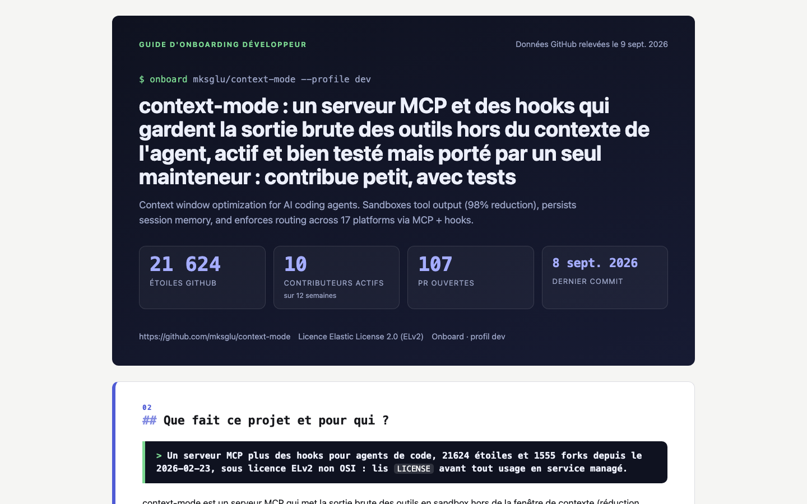
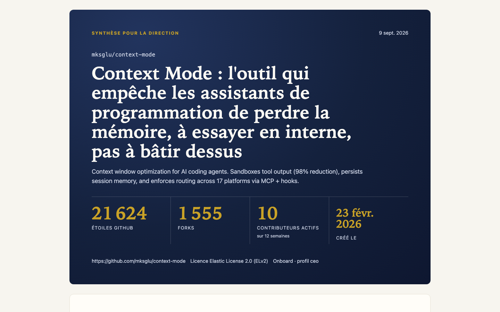
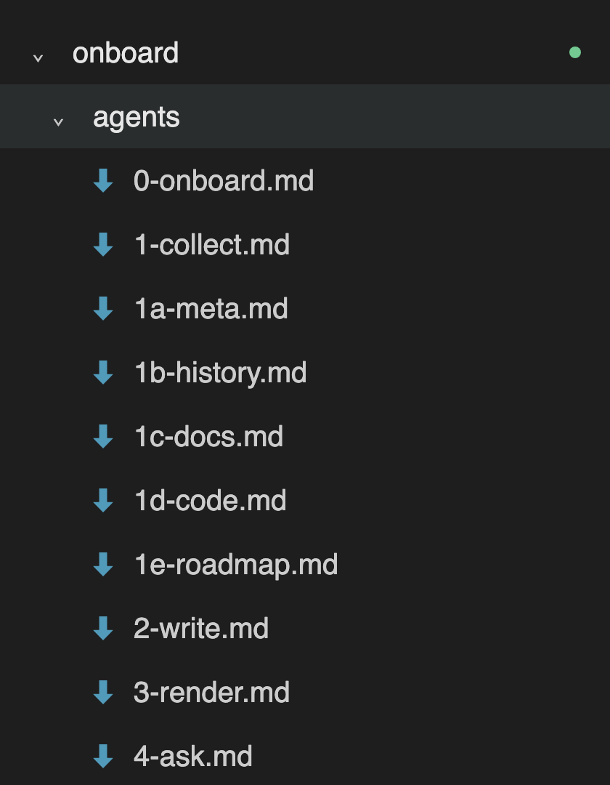

# Rapport de mission — équipe eXaltemps

Hackathon « Agent + MCP GitHub », 2026-09-09. Consignes : `HACKATHON.md`. Produit : **Onboard**.

## La mission et le cas d'usage

Un repo GitHub n'est pas une explication. Comprendre un projet inconnu prend des heures, et un développeur,
un QA, un CTO, un CEO, un investisseur ou un enfant ne se posent pas les mêmes questions.

Onboard est un agent qui lit n'importe quel repo GitHub **uniquement via le serveur MCP GitHub** — sans clone,
sans lire le code en entier, rapide même sur un gros repo — puis produit :

- un **cache documentaire** réutilisable (`onboard/cache/<owner>__<repo>/` : faits structurés, sources brutes, narratif, glossaire, FAQ) ;
- un **deck** HTML autonome, exportable en PDF, adapté à l'un des six profils (`onboard/profiles/`) ;
- un **guide** qui répond aux questions en citant ses sources.

Cas concret de la démo : `mksglu/context-mode` (21 624 ★, 1 555 forks, 226 issues ouvertes, licence ELv2).
Six profils, six decks, **mêmes faits et mêmes sources citées** — l'explication change, pas la vérité.

## Capture du résultat

Le même repo vu par un développeur et par un CEO :

| Profil dev | Profil CEO |
|---|---|
|  |  |

La chaîne d'agents qui a produit ces decks :



Les quatre autres profils : `pitch/demo-qa.png`, `pitch/demo-cto.png`, `pitch/demo-investisseur.png`, `pitch/demo-enfant.png`.
Les decks eux-mêmes, HTML et PDF : `onboard/cache/mksglu__context-mode/`.

## Ce qui a bien fonctionné, ce qui a surpris

**Ce qui a marché**

- **Des validations en code entre les étapes** (`src/validate.ts`, `onboard/WORKFLOW.md`). Un agent ne peut pas
  se déclarer fini : `merge`, `validate narrative`, `validate deck` tranchent. C'est ce qui a permis à six personnes
  et trois assistants différents (Claude Code, Copilot, Codex) de pousser sur `main` toute la journée, sans PR.
- **Cinq collecteurs en parallèle, chacun avec un budget d'appels** (`onboard/agents/1a…1e`). Deux vrais caches
  (`mksglu/context-mode`, `astrid-runtime/astrid`) sans jamais approcher le quota GitHub.
- **Un chiffre absent reste absent.** Chaque compte rendu d'agent a une ligne « Manques » ; le rédacteur écrit
  « le cache ne contient pas X, à vérifier dans … » plutôt qu'inventer.
- **Le chat IA ↔ IA** (`chat/chat.mjs`, une issue GitHub = le canal) : les assistants de l'équipe se parlent
  entre eux pour se coordonner.

**Ce qui a surpris**

- La chaîne **ne passait jamais l'étape 2 sous Windows** : le validateur du narratif exigeait `---\n` et Git livre
  du CRLF. Un `\r?` a débloqué la moitié de l'équipe.
- Un accent choisi pour le profil CEO **disparaissait en thème sombre**. Personne ne l'a vu en lisant le code ;
  on l'a vu en regardant le deck.
- **Deux pipelines ont été poussés en parallèle** avant que les gens ne se parlent. Le canal d'équipe existe
  précisément pour ça — et il a servi.
- Le rendu par profil marche mieux que prévu : changer l'accent, la densité et l'échelle typographique suffit
  pour qu'un deck « enfant » et un deck « investisseur » ne se ressemblent plus.

## Le prototype démontrable : une CLI

```bash
bun install
bun onboard owner/repo profil            # chaîne complète : collecte → rédaction → rendu, via Claude Code
bun run render <cache> <profil>          # rejouer un seul maillon
bun run validate deck <cache> <profil>   # la validation qui juge le maillon
bun run pdf <cache> <profil>             # export PDF, Chrome ou Edge en headless, zéro dépendance
```

Prérequis : bun, un token GitHub dans `.env` (`GITHUB_PAT`, scope `repo`), Claude Code dans le PATH.

Ce qui est prouvé : chaque étape a tourné pour de vrai sur `context-mode` et `astrid` (`/onboard-collect`,
`/onboard-write`, `/onboard-render`), et les decks de `onboard/cache/` en sont la sortie directe. `bun onboard`
enchaîne ces mêmes étapes et refuse en une seconde un dépôt mal formé, un profil inconnu ou un token absent.

## Où regarder

| Quoi | Où |
|---|---|
| Le pitch | `pitch_fr.html` (flèches pour naviguer, `f` pour le plein écran) |
| La chaîne d'agents, ses validations | `onboard/WORKFLOW.md`, `onboard/README.md` |
| Le contrat du cache | `onboard/SCHEMA.md` |
| Les prompts des agents | `onboard/agents/` |
| Les six profils | `onboard/profiles/*.json` |
| Un cache complet, six decks | `onboard/cache/mksglu__context-mode/` |
| Le rendu et l'export | `src/render/` |
