<p align="center">
  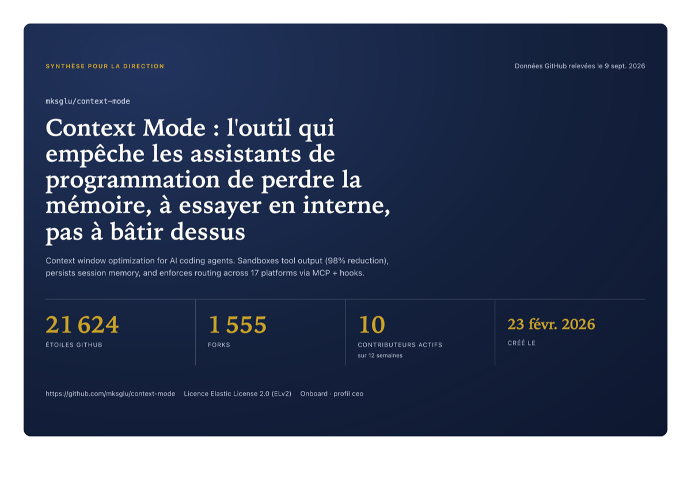
</p>

<h1 align="center">Onboard</h1>

<p align="center"><strong>Un repo GitHub. Six publics. Six decks qui citent leurs sources.</strong></p>

<p align="center">
  <code>bun onboard owner/repo profil</code>
</p>

<p align="center">
  Onboard est un agent qui parcourt n'importe quel dépôt GitHub par le serveur MCP GitHub, en tire un cache documentaire
  vérifié, puis produit une présentation taillée pour la personne qui la lit : développeur, testeur, CTO, dirigeant,
  investisseur, ou enfant de dix ans. Chaque chiffre renvoie à sa source. Rien n'est inventé.
</p>

---

## Le problème

Un dépôt GitHub n'est pas une explication. Le code, la configuration, la documentation, les tests, les issues et les
pull requests sont éparpillés dans des centaines de fichiers. Et la question que l'on se pose dépend de qui on est :

| 👩‍💻 Développeur | 🧪 QA | 🏗️ CTO | 💼 CEO | 📈 Investisseur | 🧒 Enfant |
|---|---|---|---|---|---|
| Par où je commence à lire ? | Où est-ce que ça casse ? | J'adopte, je contribue ou je forke ? | Ça marche, et qui est derrière ? | Traction, équipe, défendabilité ? | C'est quoi, et à quoi ça sert ? |

Onboarding lent, compréhension fragmentée, temps perdu. Onboard répond à chacun, avec les mêmes faits.

## Ce que ça produit

Une commande, un profil, et un deck de 7 à 10 pages : HTML autonome, PDF prêt à envoyer. Voici les six decks générés
sur [mksglu/context-mode](https://github.com/mksglu/context-mode), un serveur MCP à 21 000 étoiles. Cliquez pour ouvrir le PDF.

<table>
  <tr>
    <td align="center"><a href="../onboard/cache/mksglu__context-mode/deck-dev.pdf">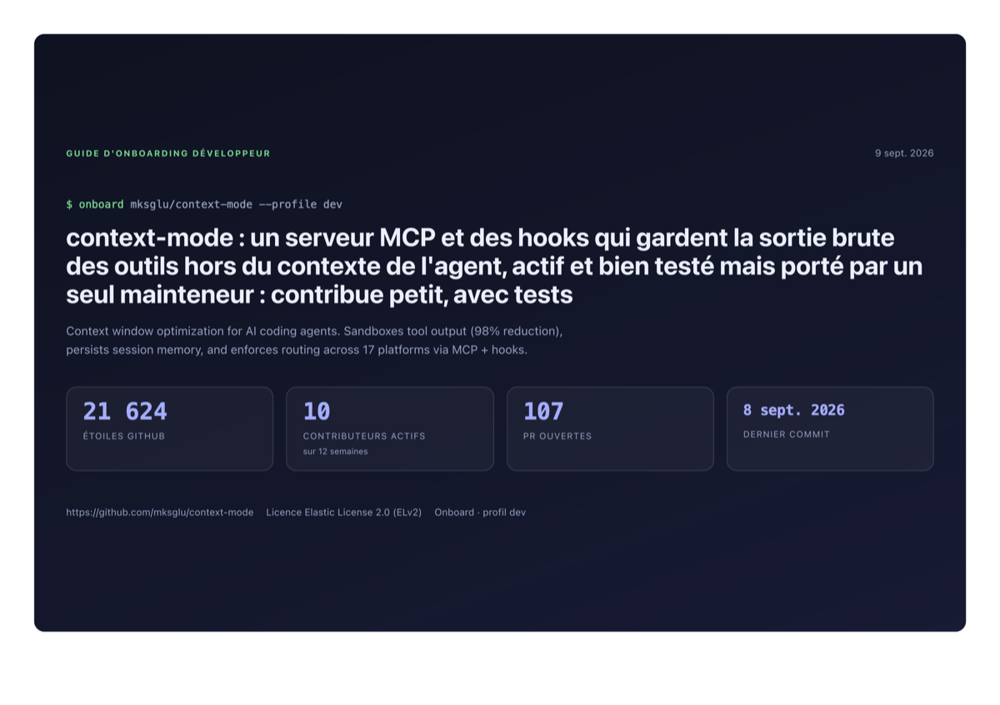</a><br><strong>👩‍💻 dev</strong> · guide d'onboarding, air d'IDE</td>
    <td align="center"><a href="../onboard/cache/mksglu__context-mode/deck-qa.pdf">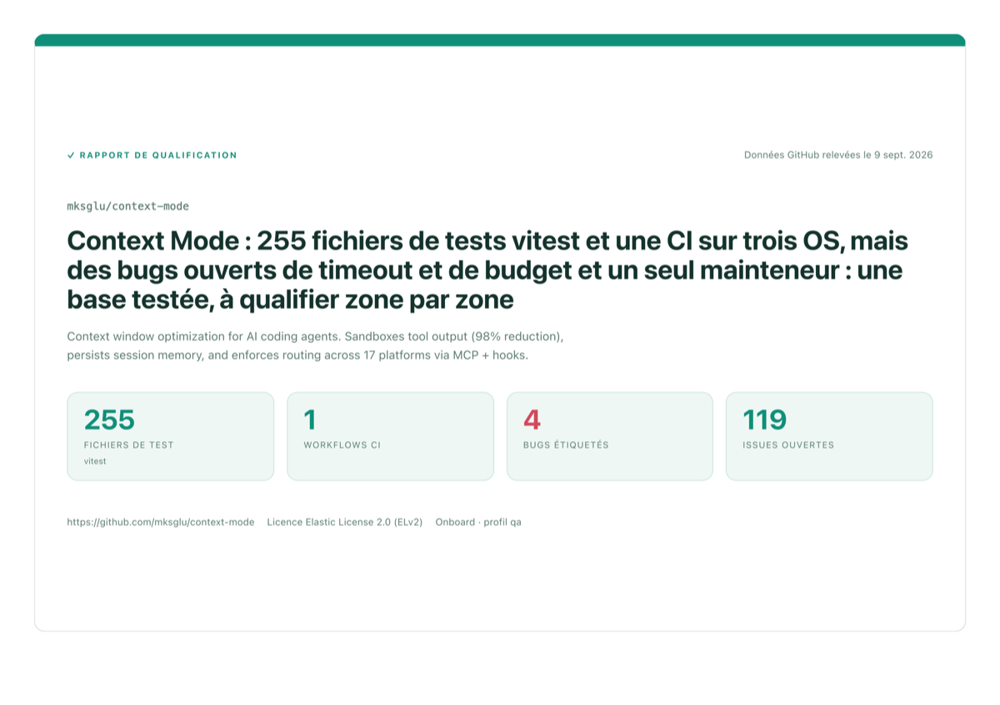</a><br><strong>🧪 qa</strong> · rapport de qualification</td>
  </tr>
  <tr>
    <td align="center"><a href="../onboard/cache/mksglu__context-mode/deck-cto.pdf">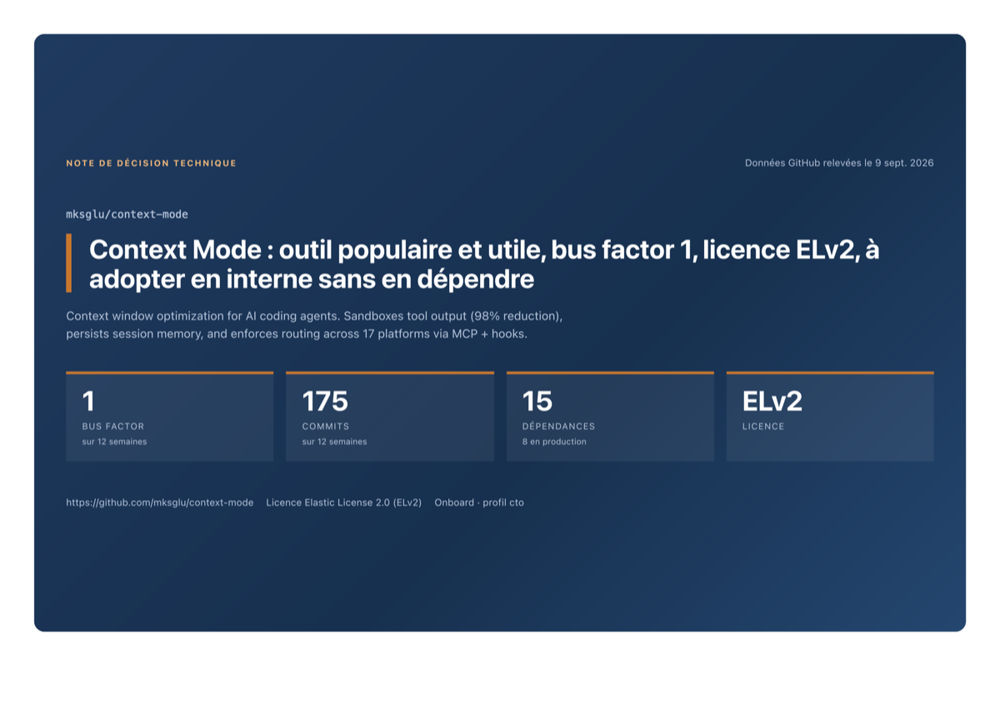</a><br><strong>🏗️ cto</strong> · note de décision</td>
    <td align="center"><a href="../onboard/cache/mksglu__context-mode/deck-ceo.pdf"></a><br><strong>💼 ceo</strong> · synthèse pour la direction</td>
  </tr>
  <tr>
    <td align="center"><a href="../onboard/cache/mksglu__context-mode/deck-investisseur.pdf">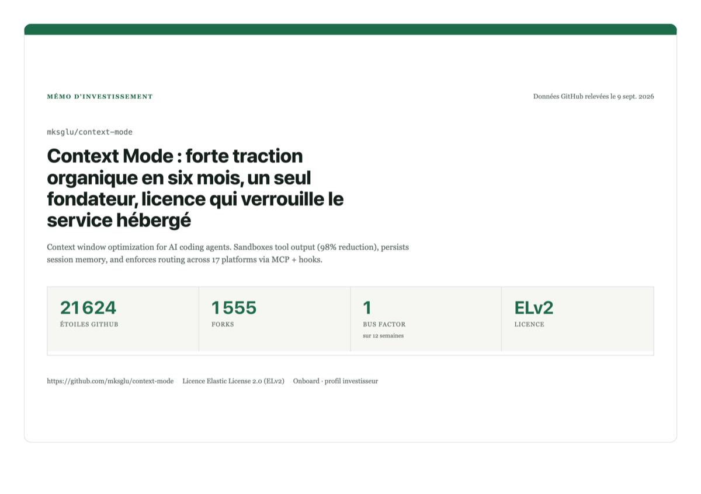</a><br><strong>📈 investisseur</strong> · mémo d'investissement</td>
    <td align="center"><a href="../onboard/cache/mksglu__context-mode/deck-enfant.pdf">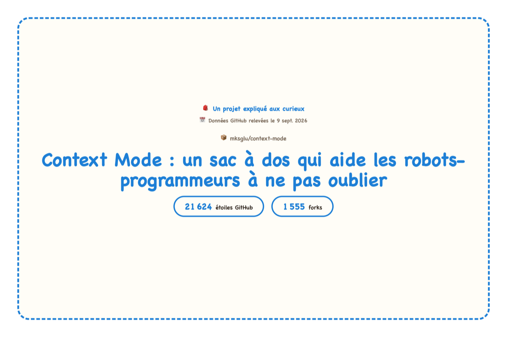</a><br><strong>🧒 enfant</strong> · album illustré</td>
  </tr>
</table>

Même dépôt, même cache, mêmes sources. Six documents qui ne se ressemblent pas, parce que leurs lecteurs ne se ressemblent pas.

## Un public, un document

Chaque profil est un fichier JSON : les questions que ce public se pose, dans l'ordre où il se les pose, le ton, la
page de clôture, et une direction artistique. Le rédacteur écrit pour ce public, le rendu lui donne son identité visuelle.

### 👩‍💻 Développeur : « Vos 3 premières actions »

Chemins exacts, commandes copiables, arborescence annotée, première issue à prendre. Titres en monospace, couverture en terminal.

<a href="../onboard/cache/mksglu__context-mode/deck-dev.pdf">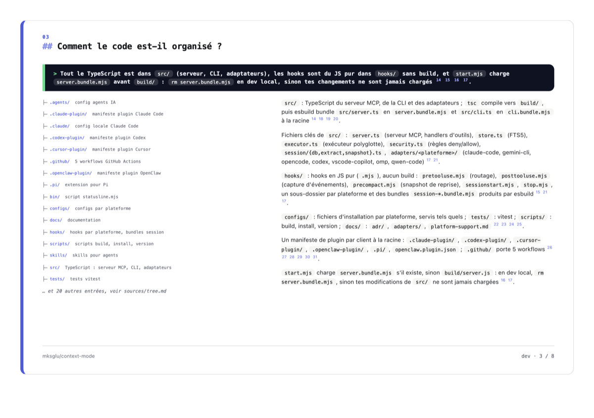</a>

### 🧪 QA : « Plan de test en 5 points »

Parcours critiques, CI, bugs connus par numéro d'issue, zones peu couvertes. Cases à cocher, verdict par page, plan numéroté.

<a href="../onboard/cache/mksglu__context-mode/deck-qa.pdf">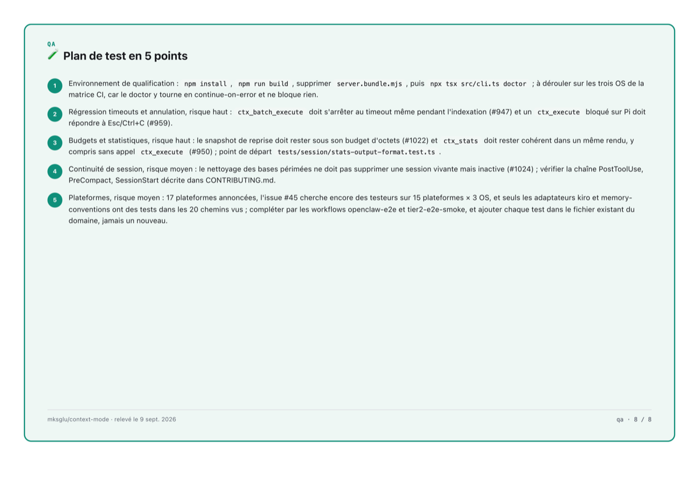</a>

### 🏗️ CTO : « Décision »

Santé technique, bus factor, dépendances, risques avec niveau et parade, recommandation assumée. Bleu nuit, ambre, tableaux.

<a href="../onboard/cache/mksglu__context-mode/deck-cto.pdf">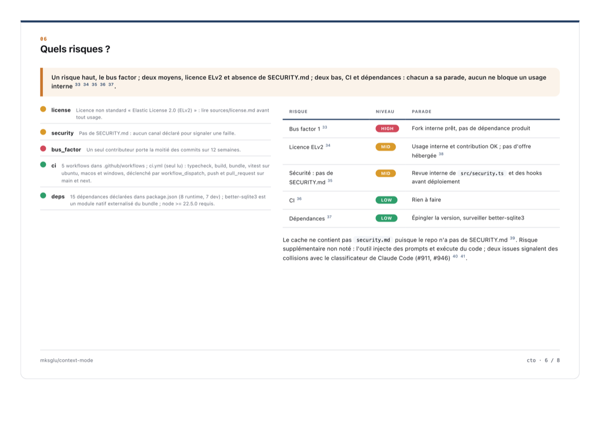</a>

### 💼 CEO : « Ce que je retiens »

Une idée par page, un gros chiffre, une phrase à retenir, aucun jargon. Serif de titrage, or sur bleu nuit.

<a href="../onboard/cache/mksglu__context-mode/deck-ceo.pdf">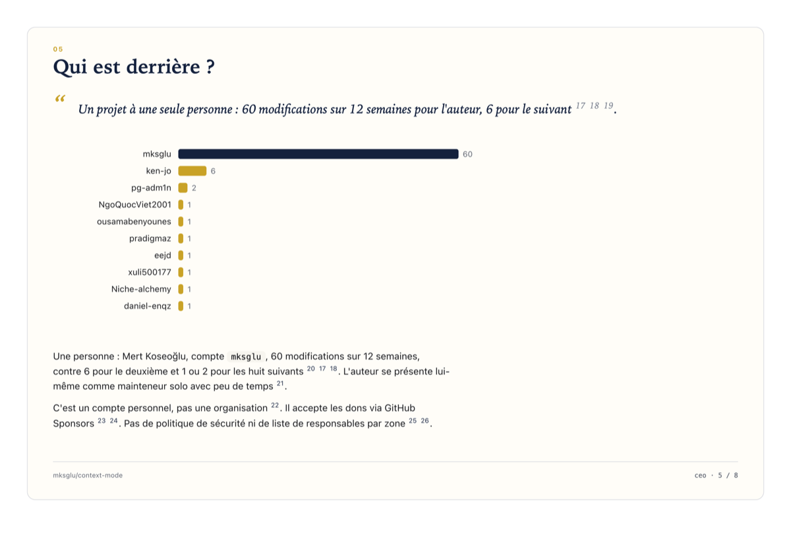</a>

### 📈 Investisseur : « Thèse en 3 lignes »

Traction, dynamique, gouvernance, licence, concurrence, verdict. Sobre, chiffré, sans enthousiasme.

<a href="../onboard/cache/mksglu__context-mode/deck-investisseur.pdf">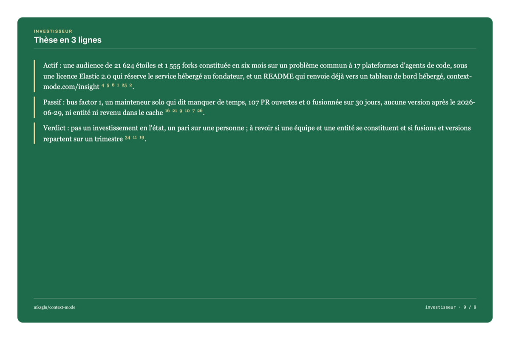</a>

### 🧒 Enfant : « Et toi, tu ferais quoi avec ? »

Tutoiement, une image du quotidien par page, pas une note de bas de page. Police ronde, une couleur par page.

<a href="../onboard/cache/mksglu__context-mode/deck-enfant.pdf">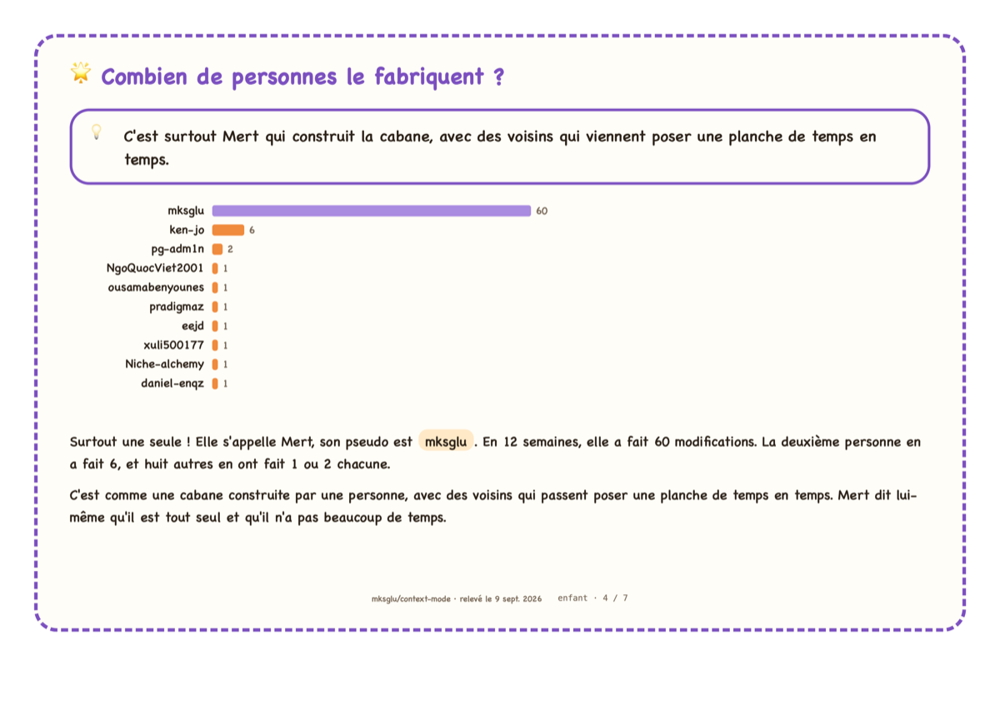</a>

## Onboard vu par Onboard

Le meilleur test d'un outil d'onboarding, c'est lui-même. Le pipeline a tourné sur ce dépôt, en ligne, par le serveur MCP
GitHub, sans intervention : `bun onboard jordanvalnet/exalthon26 <profil>`, six fois. Voici comment Onboard se présente
à chacun de ses lecteurs. Cliquez pour ouvrir le PDF.

<table>
  <tr>
    <td align="center"><a href="../onboard/cache/jordanvalnet__exalthon26/deck-dev.pdf">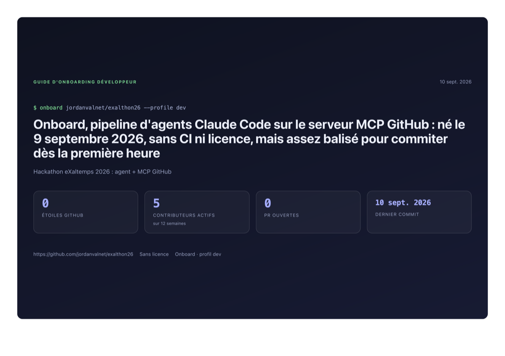</a><br>👩‍💻 <strong>dev</strong> · guide d'onboarding</td>
    <td align="center"><a href="../onboard/cache/jordanvalnet__exalthon26/deck-qa.pdf">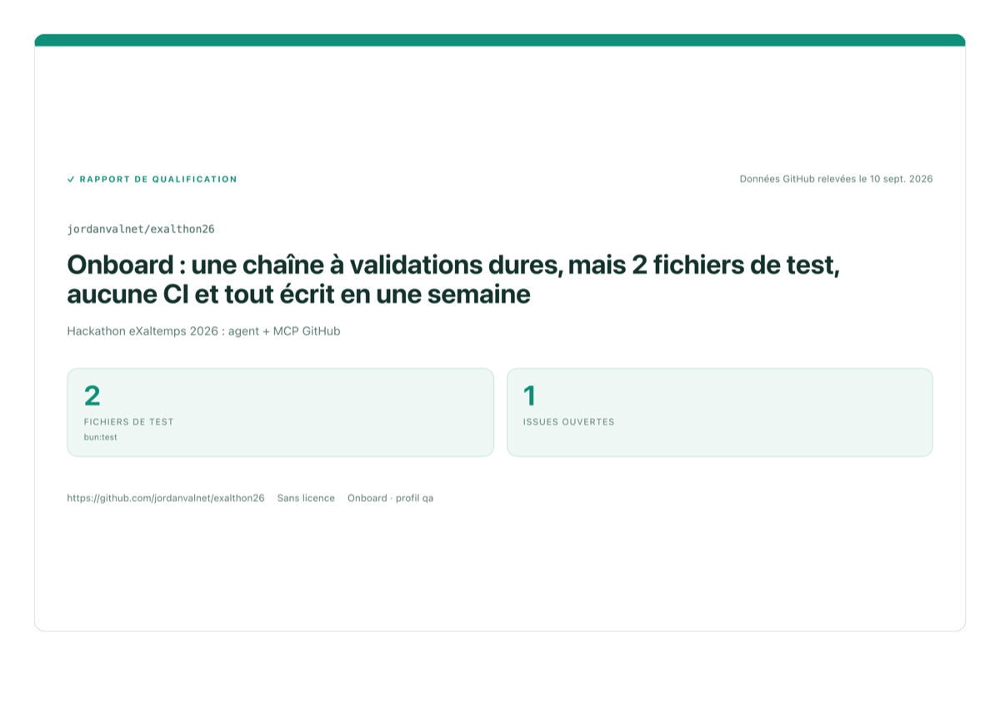</a><br>🧪 <strong>qa</strong> · rapport de qualification</td>
  </tr>
  <tr>
    <td align="center"><a href="../onboard/cache/jordanvalnet__exalthon26/deck-cto.pdf">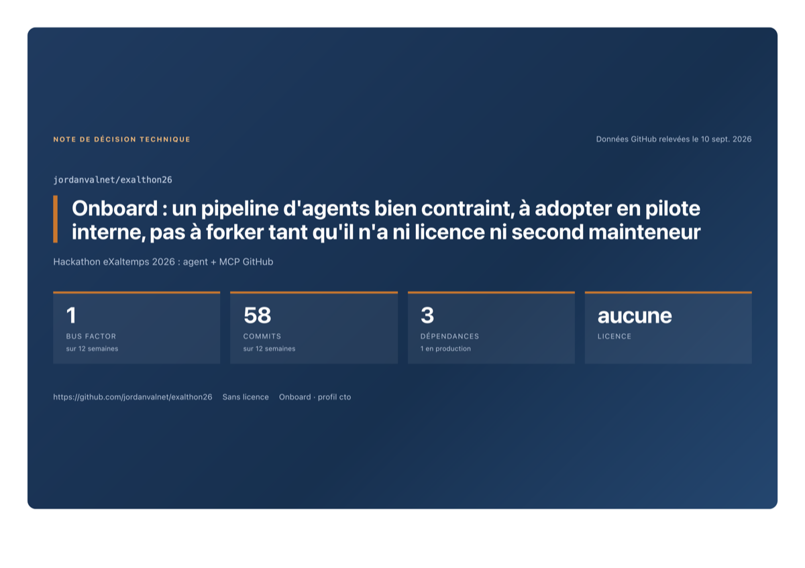</a><br>🏗️ <strong>cto</strong> · note de décision</td>
    <td align="center"><a href="../onboard/cache/jordanvalnet__exalthon26/deck-ceo.pdf">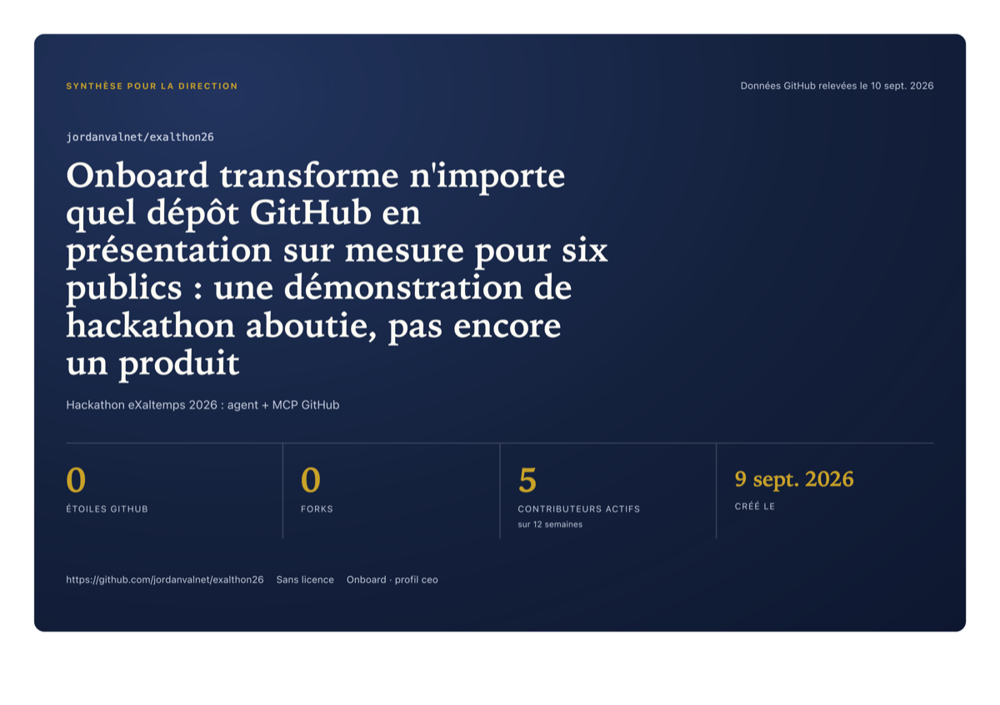</a><br>💼 <strong>ceo</strong> · synthèse pour la direction</td>
  </tr>
  <tr>
    <td align="center"><a href="../onboard/cache/jordanvalnet__exalthon26/deck-investisseur.pdf">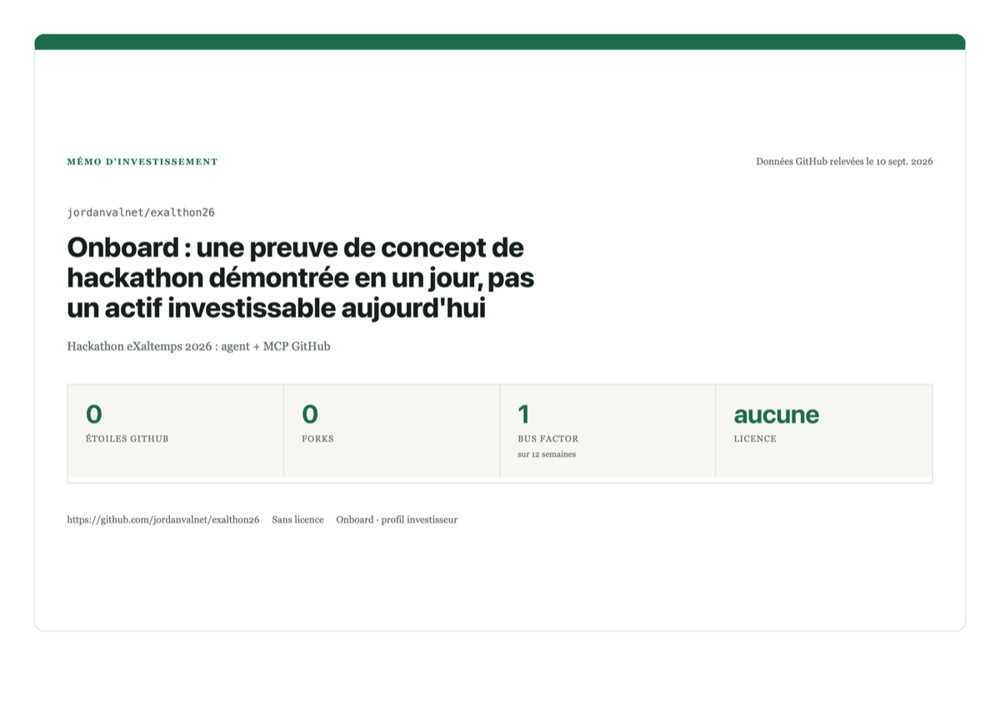</a><br>📈 <strong>investisseur</strong> · mémo d'investissement</td>
    <td align="center"><a href="../onboard/cache/jordanvalnet__exalthon26/deck-enfant.pdf">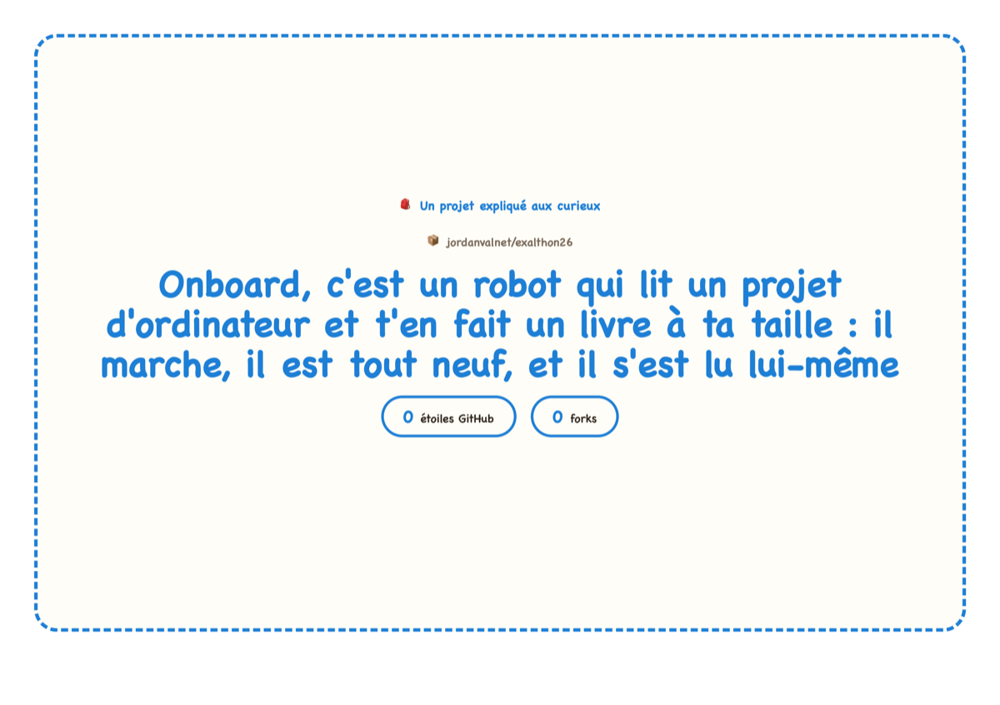</a><br>🧒 <strong>enfant</strong> · album illustré</td>
  </tr>
</table>

Le cache complet est dans [onboard/cache/jordanvalnet__exalthon26/](../onboard/cache/jordanvalnet__exalthon26/) : les
faits collectés, les sources relues, les six narratifs, la FAQ et le glossaire.

## Ne répondez pas seulement, montrez pourquoi

Chaque affirmation d'un deck porte une note qui renvoie à une donnée collectée, à un fichier du dépôt ou à une URL
GitHub. La dernière page liste les sources. Un dirigeant peut vérifier ; un développeur peut cliquer.

Et le deck n'est que le début. Le cache reste là, et un guide y répond aux questions en citant ses sources, en allant
relire le dépôt s'il le faut :

```
/onboard-ask mksglu/context-mode ceo "Combien ça coûte et peut-on l'intégrer dans un produit que nous vendons ?"
```

> Rien à l'achat : la licence Elastic 2.0 accorde un droit d'usage gratuit et mondial pour un usage interne.
> En revanche, elle interdit de fournir le logiciel à des tiers comme service hébergé ou géré.
> Un produit vendu qui embarque Context Mode comme service demande donc un avis juridique, voire un accord avec l'auteur.
> Sources : `repo.license`, `sources/license.md`, `sources/funding.md`.

Chaque réponse s'ajoute à la FAQ du cache. Le dépôt devient plus facile à comprendre à chaque question posée.

## Comment ça marche

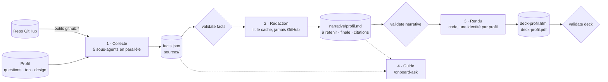
```mermaid
flowchart LR
  R[("Repo GitHub")] -- "outils github:*" --> C["1 · Collecte<br/>5 sous-agents en parallèle"]
  P[("Profil<br/>questions · ton · design")] --> C
  C --> F[("facts.json<br/>sources/")]
  F --> V1{"validate facts"}
  V1 --> W["2 · Rédaction<br/>lit le cache, jamais GitHub"]
  W --> N[("narrative/profil.md<br/>à retenir · finale · citations")]
  N --> V2{"validate narrative"}
  V2 --> D["3 · Rendu<br/>code, une identité par profil"]
  D --> K[("deck-profil.html<br/>deck-profil.pdf")]
  K --> V3{"validate deck"}
  F -.-> G["4 · Guide<br/>/onboard-ask"]
  N -.-> G
```

Trois règles tiennent l'ensemble :

1. **GitHub se lit par le MCP, et seulement par lui.** Pas de clone, pas d'API REST, pas de lecture du code en entier.
   Cinq collecteurs en parallèle, chacun avec un budget d'appels : rapide même sur un gros dépôt.
2. **Une validation en code entre chaque étape.** Un agent ne peut pas se déclarer fini : la commande dit OK ou liste
   les erreurs, et l'agent corrige. Chaque citation `[facts:…]` est résolue dans le JSON, chaque `[src:…]` doit exister.
3. **Rien d'inventé.** Une donnée absente reste absente et se dit : « le cache ne contient pas X, à vérifier dans … ».

Le cache est du texte versionné : on relit, on diffe, on corrige à la main, on rejoue l'étape suivante.

## Deux dépôts, douze decks

| Dépôt | dev | qa | cto | ceo | investisseur | enfant |
|---|---|---|---|---|---|---|
| [mksglu/context-mode](https://github.com/mksglu/context-mode) · serveur MCP, TypeScript, 21 k ★ | [PDF](../onboard/cache/mksglu__context-mode/deck-dev.pdf) | [PDF](../onboard/cache/mksglu__context-mode/deck-qa.pdf) | [PDF](../onboard/cache/mksglu__context-mode/deck-cto.pdf) | [PDF](../onboard/cache/mksglu__context-mode/deck-ceo.pdf) | [PDF](../onboard/cache/mksglu__context-mode/deck-investisseur.pdf) | [PDF](../onboard/cache/mksglu__context-mode/deck-enfant.pdf) |
| [astrid-runtime/astrid](https://github.com/astrid-runtime/astrid) · runtime d'agents, Rust, 10 k ★ | [PDF](../onboard/cache/astrid-runtime__astrid/deck-dev.pdf) | [PDF](../onboard/cache/astrid-runtime__astrid/deck-qa.pdf) | [PDF](../onboard/cache/astrid-runtime__astrid/deck-cto.pdf) | [PDF](../onboard/cache/astrid-runtime__astrid/deck-ceo.pdf) | [PDF](../onboard/cache/astrid-runtime__astrid/deck-investisseur.pdf) | [PDF](../onboard/cache/astrid-runtime__astrid/deck-enfant.pdf) |

Les caches complets, faits, sources, narratifs, glossaires et FAQ, sont dans [onboard/cache/](../onboard/cache/).

## Lancer chez vous

```bash
curl -fsSL https://bun.sh/install | bash        # bun, jamais npm
cp .env.example .env                            # GITHUB_PAT=<token, scope repo>
bun install && bun run check
bun onboard owner/repo ceo                      # deck dans onboard/cache/<owner>__<repo>/
bun run pdf onboard/cache/<owner>__<repo> ceo   # le PDF
```

Dans Claude Code, la même chose en skills : `/onboard owner/repo profil`, puis `/onboard-ask owner/repo profil "question"`.
Les prompts des agents sont dans [onboard/agents/](../onboard/agents/) : Copilot et Codex exécutent le même texte.

## Sous le capot

- [onboard/README.md](../onboard/README.md) : le flux illustré, le cache, les profils, les skills.
- [onboard/WORKFLOW.md](../onboard/WORKFLOW.md) : la chaîne d'agents, IN, OUT, validations dures.
- [onboard/SCHEMA.md](../onboard/SCHEMA.md) : le contrat des fichiers, les graphiques, le bloc `design` des profils.
- [src/render/theme.ts](../src/render/theme.ts) : l'identité visuelle de chaque profil, tout inline, zéro ressource externe.

---

<p align="center">
  Construit en une journée par l'équipe eXaltemps au hackathon « Agent + MCP GitHub », le 9 septembre 2026.<br>
  De « je ne connais pas ce repo » à « je le comprends ».
</p>
