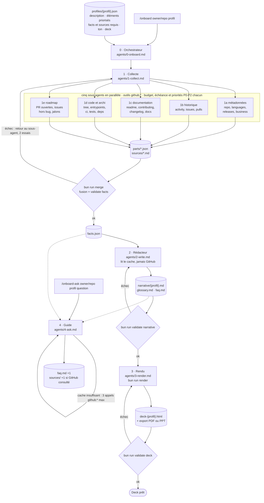

# Onboard

Un repo GitHub en entrée, un profil de lecteur, et en sortie : un **cache documentaire** réutilisable, un **deck** de quelques
pages adapté à ce lecteur (dev, qa, cto, ceo, investisseur, enfant), et un **guide** qui répond aux questions en citant ses sources.
Tout passe par le MCP GitHub : pas de clone, pas de lecture du code en entier, rapide même sur un gros repo.

```
/onboard owner/repo profil
```

## Le flux



Trois règles font tenir l'ensemble :
1. **Chaque agent ne lit que ses IN et n'écrit que ses OUT.** Le rédacteur ne va jamais sur GitHub ; les collecteurs ne touchent pas au texte.
2. **Une validation en code entre chaque étape.** Un agent ne peut pas se déclarer fini : la commande dit OK ou liste les erreurs, l'agent corrige, deux essais.
3. **Rien d'inventé.** Une donnée absente reste absente et se dit dans « Manques ».
4. **GitHub se lit par le serveur MCP uniquement.** Outils `github:*` pour les agents, client MCP de `onboarding/src/` pour le code. Aucun appel REST, aucun `gh`, aucun `curl`, aucun clone. Ce que le MCP n'expose pas est un manque déclaré avec son URL.
   Le quota GitHub se gère par budget, échéance et priorités : les appels jetables partent d'abord, une erreur de quota arrête sans réessayer ([WORKFLOW.md](WORKFLOW.md), règle 8).

## Les étapes

| # | Étape | Prompt | IN | OUT | Validation dure |
|---|---|---|---|---|---|
| 0 | Orchestrer | `agents/0-onboard.md` | `owner/repo profil [--force]` | enchaîne 1 → 2 → 3, saute ce qui est à jour | chacune ci-dessous |
| 1 | Collecter | `agents/1-collect.md` + `1a` … `1e` | le repo via `github:*`, le profil | `parts/*.json`, `sources/*.md`, puis `facts.json` | `bun run merge <cache> <profil>` |
| 2 | Rédiger | `agents/2-write.md` | `facts.json`, `sources/`, le profil | `narrative/{profil}.md`, `glossary.md`, `faq.md` | `bun run validate narrative <cache> <profil>` |
| 3 | Rendre | `agents/3-render.md` | `facts.json`, `narrative/{profil}.md`, le profil | `deck-{profil}.html`, PDF ou PPT | `bun run validate deck <cache> <profil>` |
| 4 | Guider | `agents/4-ask.md` | le cache, une question, `github:*` en secours | la réponse citée, `faq.md` +1 | `faq.md` a une entrée de plus |

`<cache>` = `onboard/cache/<owner>__<repo>`. Détail des règles de chaînage : [WORKFLOW.md](WORKFLOW.md).

## Le cache, contrat entre les agents

```
onboard/cache/<owner>__<repo>/
├── parts/                 une part par sous-agent de collecte : meta.json, history.json, docs.json, code.json, roadmap.json
├── facts.json             les chiffres et faits, fusion des parts, schéma zod dans src/facts.ts
├── sources/               extraits bruts du repo, tels que lus : readme.md, tree.md, contributing.md, ci.md, manifest.md, license.md …
├── narrative/{profil}.md  le texte pour un profil : une section H2 par question, chaque phrase citée [facts:…] [src:…] [gh:…]
├── glossary.md            un terme par ligne
├── faq.md                 questions et réponses accumulées, tous profils
└── deck-{profil}.html     la présentation, autonome, imprimable en PDF
```

Les blocs de `facts.json`, les graphiques disponibles et les formats exacts sont dans [SCHEMA.md](SCHEMA.md).
[cache/example/](cache/example/) est un cache fictif conforme : il sert à développer le rendu et le guide sans attendre la collecte.

## Le profil, input du pipeline

Un JSON par public dans [profiles/](profiles/). L'ordre des éléments est l'ordre des sections et des pages.
Chaque élément dit ce qu'il lui faut : c'est la liste de courses des collecteurs.

```json
{
  "name": "dev",
  "description": "Développeur ou développeuse qui rejoint le projet la semaine prochaine.",
  "tone": "Direct, technique, chemins de fichiers exacts, commandes copiables.",
  "deck": { "pages": 9, "finale": "Vos 3 premières actions" },
  "design": { "brief": "Un guide de prise en main, dense et copiable.", "eyebrow": "Guide d'onboarding développeur", "kpis": ["repo.stars", "pulls.open"] },
  "priorities": [
    { "question": "Que fait ce projet et pour qui ?", "facts": ["repo", "languages"], "sources": ["readme.md"] },
    { "question": "Comment le code est-il organisé ?", "chart": "tree", "facts": ["tree"], "sources": ["tree.md"] }
  ]
}
```

## Ce que fait le code

| Fichier | Rôle | Commande |
|---|---|---|
| `src/facts.ts` | Schéma zod de `facts.json`. Tout optionnel sauf `repo` et `collected`. | importé par validate et merge |
| `src/validate.ts` | Lit le profil JSON. `facts` : schéma, loupes, blocs demandés, readme et tree présents. `narrative` : en-tête, une H2 par question au libellé identique, directive chart attendue, une citation par section, chaque `[facts:x.y]` résolu dans le JSON, chaque `[src:f]` existant, 5 termes de glossaire. `deck` : aucune ressource externe, assez de sections, pas de citation brute, règle print. | `bun run validate facts\|narrative\|deck <cache> <profil>` |
| `src/merge.ts` | Fusionne `parts/*.json` et le `facts.json` existant (objets en profondeur, tableaux sans doublon), valide chaque part, unit les loupes, écrit `facts.json`, lance `validate facts`. | `bun run merge <cache> <profil>` |
| `src/gh.ts` | Appel brut d'un outil du serveur MCP GitHub depuis le code, même serveur que `.mcp.json`. Jamais d'API REST directe. | `bun run gh <outil> '<args JSON>'`, `bun run gh tools` |
| `src/quota.ts` | La couche par laquelle passe tout appel MCP du code : erreur de quota reconnue et attendue une seule fois si le reset est proche ; budget, échéance et priorités P0-P2 par collecteur, jets journalisés dans `parts/quota.json`. | `bun run quota <cache>` |
| `src/cli.ts` | Lance Claude Code en non interactif avec `/onboard`. | `bun onboard owner/repo profil` |
| `src/render/` | Le deck HTML à partir du cache : `theme.ts` une identité visuelle par profil, `kpi.ts` les tuiles de couverture, `charts.ts` les graphiques SVG, `deck.ts` l'assemblage. | `bun run render <cache> <profil>`, `bun run pdf`, `bun run screenshot` |

## Les skills

| Skill | Fait | Prompt exécuté |
|---|---|---|
| `/onboard owner/repo profil [--force]` | toute la chaîne | `agents/0-onboard.md` |
| `/onboard-collect owner/repo profil` | l'étape 1 seule | `agents/1-collect.md` |
| `/onboard-write owner/repo profil` | l'étape 2 seule | `agents/2-write.md` |
| `/onboard-render owner/repo profil` | l'étape 3 seule | `agents/3-render.md` |
| `/onboard-ask owner/repo profil "question"` | le guide | `agents/4-ask.md` |

Les skills ne contiennent que le pointeur vers le prompt : Claude Code, Copilot et Codex exécutent le même texte.

## Qui fait quoi

Le plan de construction, la définition de « fini » pour chaque morceau et la répartition : [PLAN.md](PLAN.md).
